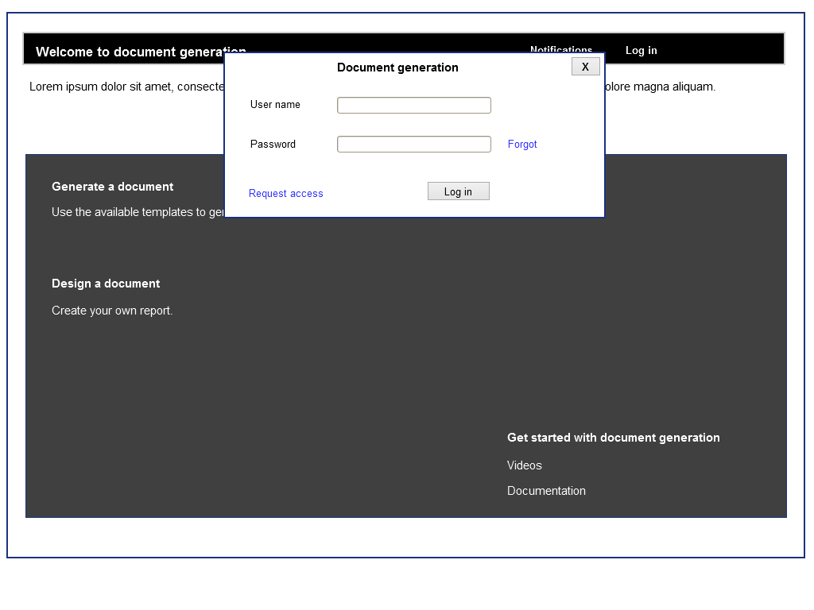
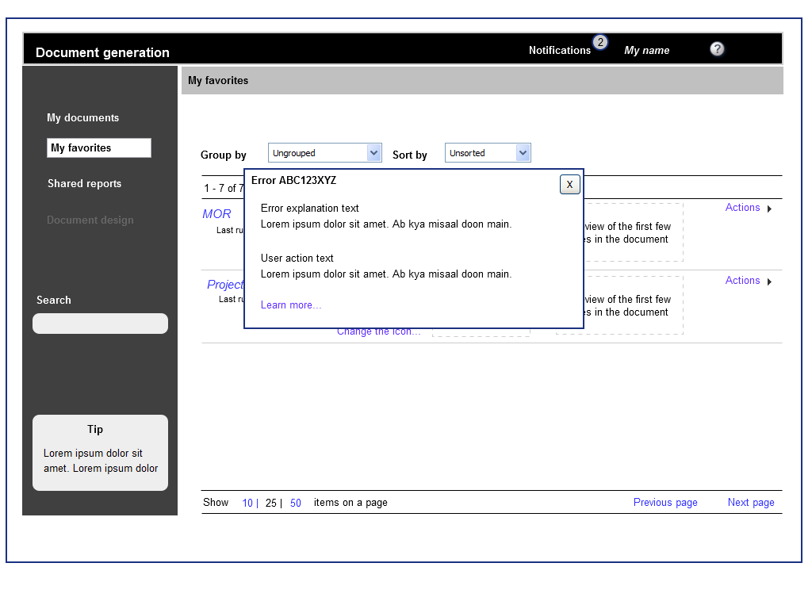
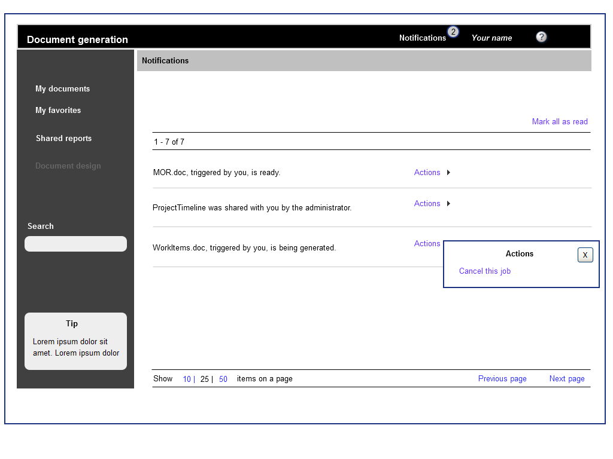
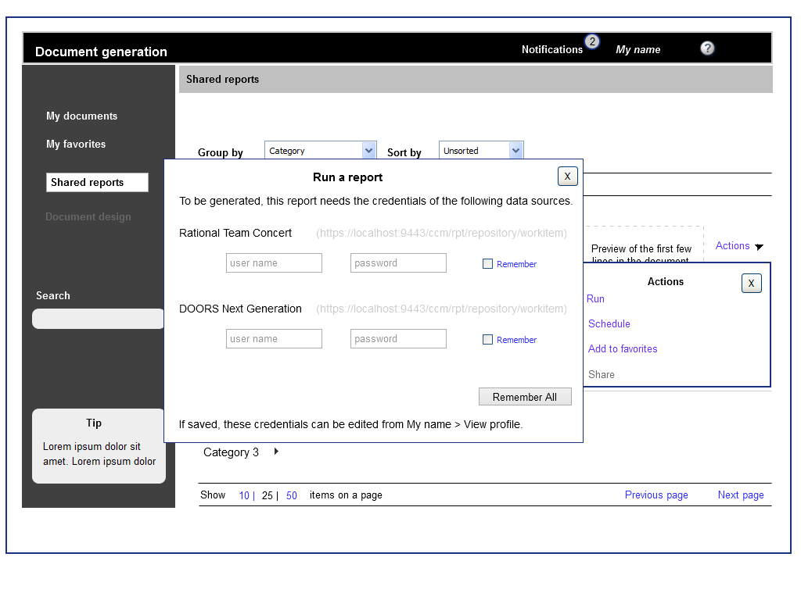
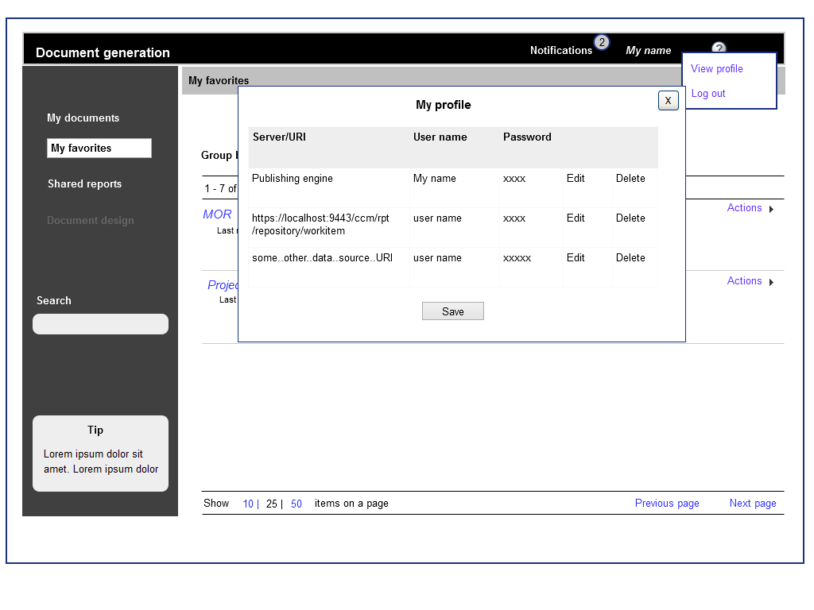
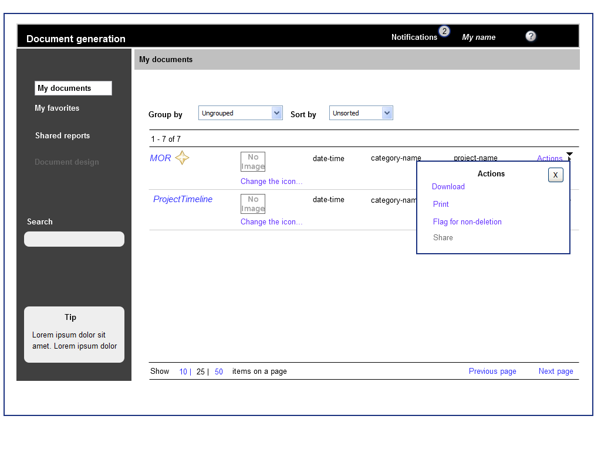
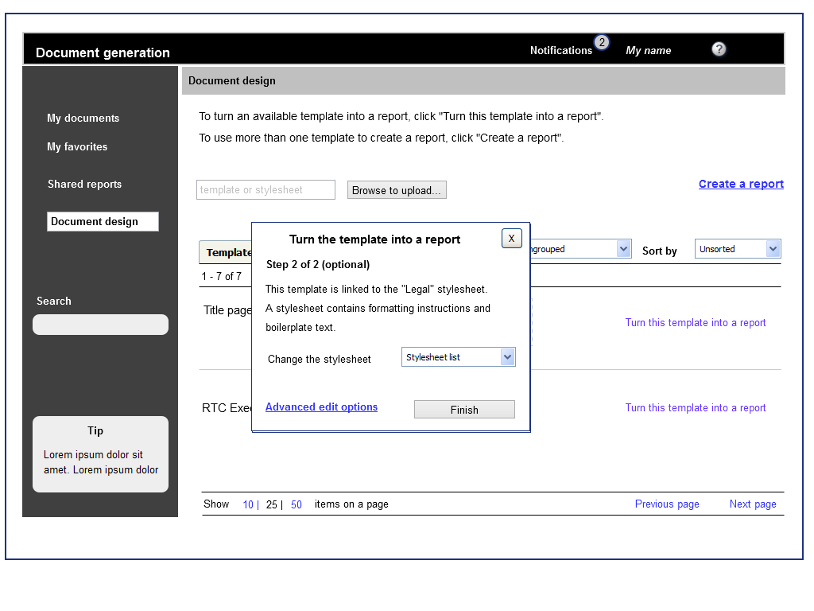

# {{ page.title }}

These are the wireframes for a report generation software. This enterprise-level software is for creating reports that contain data pulled from disparate sources. These data sources can either be documents themselves (in `DOC`, `PDF`, or `XML` formats) or be other documents created through this software. Parts (or sections) of a report can contain data from more than one source.

## User analysis

The software is used by these two categories of people:

-  Administrators: People who design the report templates and give access permissions thereto. Report templates do not change on a daily basis.
-  Users: People who run report templates to generate the actual reports.

The software is used either on a desktop or on a laptop; it is not used on any handheld device.

## Task analysis

Administrator tasks

-  Design a report template from a one or more data sources
-  Customise the properties of a report template after designing it
-  Customise the properties of a report template while designing it
-  Generate a report after creating its template
-  Share a report template after creating it

User tasks

-  Use templates to generate reports
-  Tag, favourite, and share generated reports
-  Schedule the generation of a report, and subscribe to notifications and updates
-  Stop, restart, or cancel a report-generation task started by oneself, and for shared reports

## Design goal

-  An administrator task sould not take more than 7 clicks or 3 screens.
-  A user task should not take more than 3 clicks.

## Wireframes

Only a representative set is given on this page; not all of the wireframes for this project are included.

