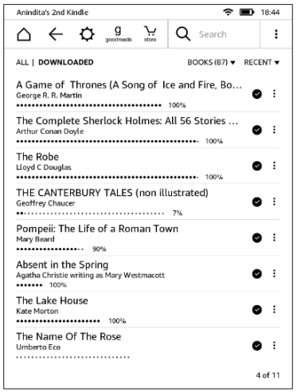
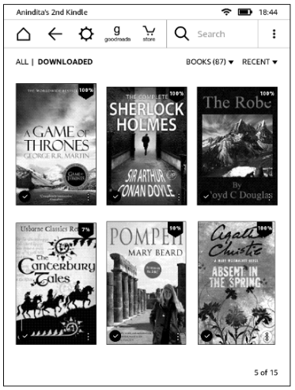
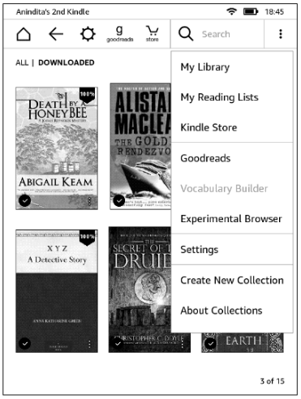
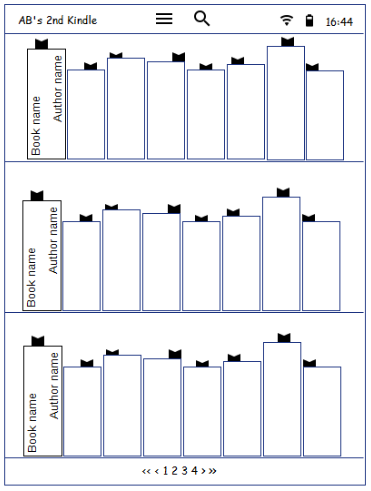
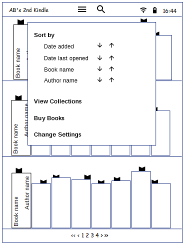
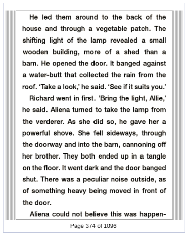
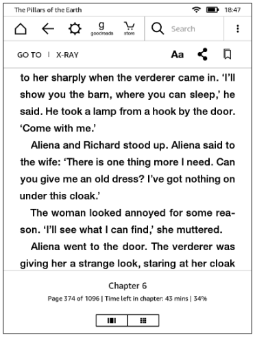
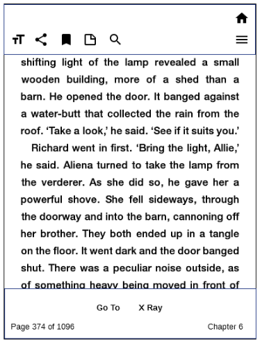
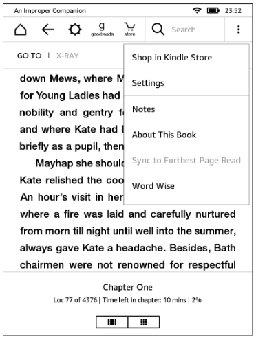
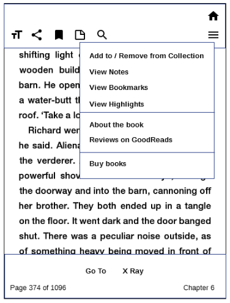

# {{ page.title }}

I am a heavy reader and I own a Kindle Reader. I don't like the user interface because it takes several taps to do common reading tasks such as browsing my library, jumping between pages of a book, or going back to bookmarks. The following wireframes show how I'd like my Kindle to be.

## Home page: Current UI

| List view | Grid view | Either view, with menu |
| --- | --- | --- |
| |  |  |

## Home page: Proposed UI

| Bookshelf view | Bookshelf view with menu |
| --- | --- |
| |  |

### Improvements

-  Less time to browse the library: 3x more books than list view and 4x more books than grid view
-  More user control: Go to a bookshelf non-sequentially through pagination at the bottom
-  Visual appeal: Bookmarks peeping from the books show current reading position rather than percentages
-  Less clutter:
    -  Actions are moved to a hamburger menu on top
    -  Most common action (Search) is separate, so needs fewer taps
    -  Actions not relevant on a bookshelf page are removed

## Book-open page: Reading

| Current UI | Proposed UI |
| --- | --- |
| |  |

### Improvements

-  Visual appeal: Indicator of unread pages on either side of current page 
-  Less clutter: Page number in 'Page X of Y' format for just-enough-information

## Book-open page: Menu options

| Current UI: Menu | Proposed UI: Menu |
| --- | --- |
| |  |

### Improvements

-  Less thumb strain: Most frequent actions are at the bottom, less frequent ones are at the top
-  Fewer taps: Common reading actions, such as notes and highlights are available upfront

| Current UI: More menu | Proposed UI: More menu |
| --- | --- |
| |  |

### Improvements

-  Less clutter: Actions not relevant to reading are removed from menu and pushed under the Home icon
-  Fewer taps: Easy to access bookmarks, notes, highlights, and do other common reader actions when a book page is open and is being read

