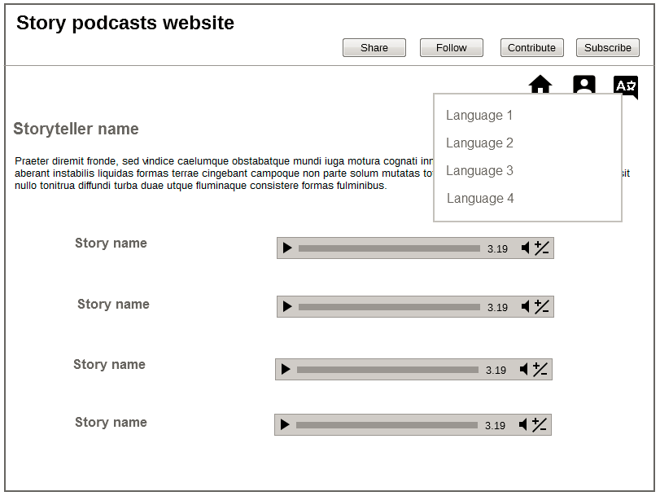
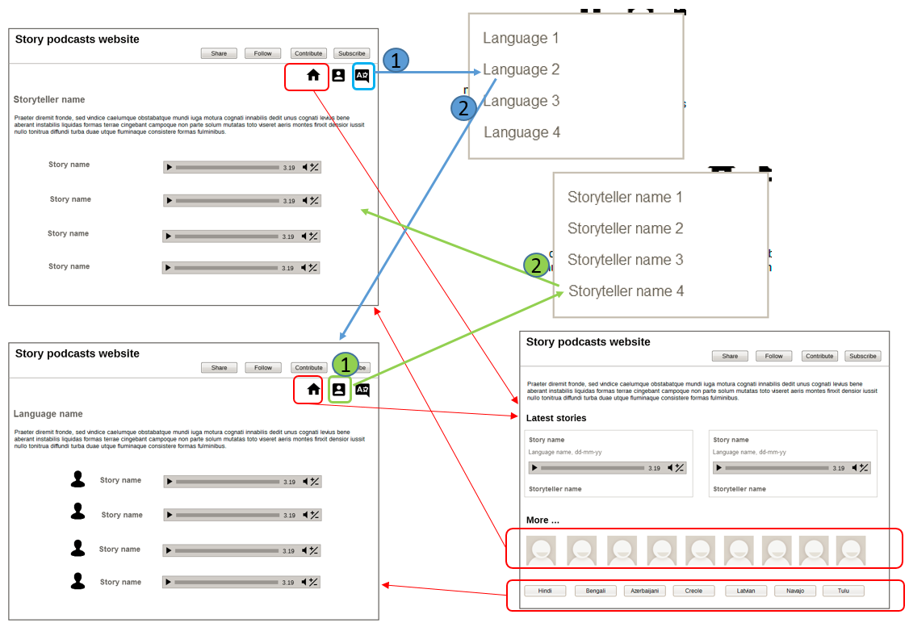

# {{ page.title }}

This is a design for a podcast website.

The website has the following structure, which shows 1-level of nesting:

```
|-- Home page
    |-- Language 1 page
    |-- Language 2 page
    |-- ...
    |-- Storyteller 1 page
    |-- Storyteller 2 page
    |-- ...
```

This structure can be adapted to any podcast site, by replacing `language` and `storyteller` with appropriate categories like `genre` and `narrator`, `theme` and `composer`, and such pairings. I kept the categories to only two so that the structure remains simple: my logic is that it should be possible to give any podcast in this world just two broad attributes (in this website, it's `language` and `storyteller`).

## Home page

The focus is on the two latest podcasts, which you can click to play. For more podcasts, you click on a storyteller or a language.

The introductory paragraph contains text about the website, and is atleast 200 words long (for good SEO).


## Storyteller page

Each storyteller has a page to themselves. The introductory paragraph contains text about the storyteller, and is atleast 200 words long (for good SEO). All podcasts by a storyteller are listed as an endless-scroll list.


## Language page

Each language has a page to itself. The introductory paragraph contains text about the language, and is atleast 200 words long (for good SEO). All podcasts in that language are listed as an endless-scroll list.


## Navigation

From the home page, you can go to a specific language or storyteller's page. From a language or a storyteller's page, you can go to the home page, or to any other language or storyteller page.




Navigation between the subsidiary pages (language pages and storyteller pages) is by means of a menu revealed on clicking the Person icon or the Language icon. The menu options are the same for all of the language pages and storyteller pages.



I debated whether to give a Search option on the language pages and storyteller pages, and did not because the intention is to make you browse through all of the podcasts on a page. The podcast list is displayed as an endless-scroll list. I did not include a Search option on the home page either because, again, the intention is to encourage you to explore the podcasts.

## Live implementation

A live implementation of this design is at [https://afsanapodcast.github.io/afsana/](https://afsanapodcast.github.io/afsana/).
