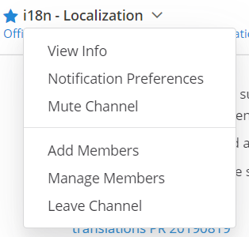
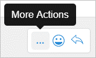
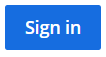
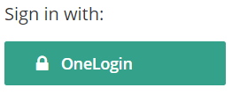
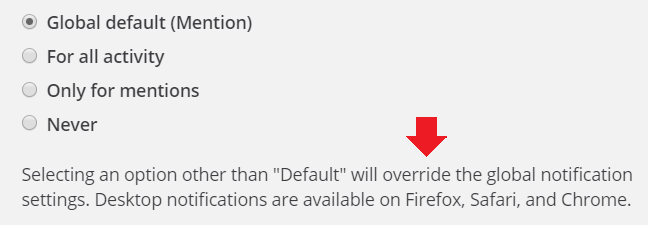
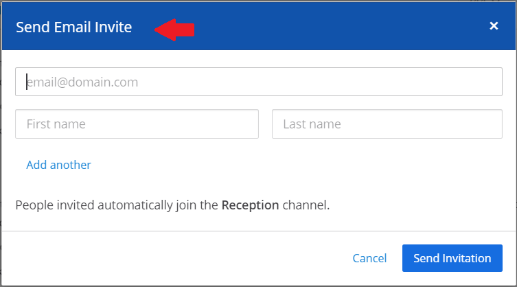

In-Code Text Guidelines
============================
This is the Mattermost style guide for in-code text. Use it as a reference to ensure that the text on the Mattermost user interface is consistent and clear.

Note

These guidelines are not intended to slow down or otherwise impede contributions, which are always welcome. No contribution will be rejected due to non-conforming style, although it might be edited.

UI elements
-----------

.. list-table::
   :widths: 40 10 15 35
   :header-rows: 1

   * - Element
     - Capitalization
     - Phrasing
     - Examples
     
   * - Menu |menu.png|
     - Headline
     - - Noun, noun phrase, or verb
       - No punctuation
       - Not more than 3 words
     - - Members
       - Account Preferences
       - Log Out
   * - Tooltip |tooltip.png|
     - Sentence
     - - Sentence fragment or sentence
       - No punctuation
       - Include articles (*a*, *an*, *the*)
     - - Start a Zoom meeting
       - Flag for following up
       - Remove from this list
   * - In-field text |field.png|  
     - Sentence
     - - Sentence fragment, sentence, or word
       - No punctuation
       - Include articles (*a*, *an*, *the*)
     - - Add a comment
       - Search
   * - Action button |action.png|
     - Headline
     - - Verb or verb phrase
       - No articles (*a*, *an*, *the*)
       - Exceptions: *OK*, *Yes*, *No*
     - - Add Comment
       - Edit
   * - Labels before a UI element |label_before.png|
     - Sentence
     - - Noun, verb, verb phrase, or sentence fragment
       - End with a colon
       - Include articles (*a*, *an*, *the*)
     - - Sign in with:
       - Other words, separated by commas:
   * - Labels after a UI element |label_after.png|
     - Sentence
     - - Noun, verb, verb phrase, or sentence fragment
       - No punctuation
     - - Channels grouped by type
       - Alphabetically
   * - Help text |help.png|
     - Sentence
     - Complete sentences, with punctuation
     - - You can add 20 more people.
       - People are invited automatically to join the channel.
   * - Title |title.png|
     - Headline
     - - Sentence fragment or sentence
       - No punctuation
     - - Notification Preferences for Channel
       - Contributors

Messages
--------
...

Notifications
~~~~~~~~~~~~~~
...

Alerts
~~~~~~
...

Errors
~~~~~~~~~~~~~~~
...

.. |field.png| image:: ./images/field.png
  :alt: field

.. |label_after.png| image:: ./images/label_after.png
  :alt: labels after a UI element

