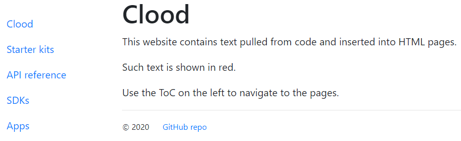

<h1>Anindita Basu</h1>

I am a technical writer.

I write menu names, button names, option labels, dialog box headings, error messages, notifications, and every little thing you see on user interfaces. I also write HowTos, tutorials, API references, admin and deployment guides, and other long-form text that you need to get any software up, running, and usable.

Sometimes, I make videos.

At other times, I draw wireframes and prototypes for user interfaces.

At all times, I remain curious. Because, that's what helps me write for my readers &mdash; they who will use my words to get their jobs done as fast as possible.

And, I treat my documents as code. I am a great fan of <a data-toggle="modal" data-target="#docsAsCodeModal">string interpolation</a>, for example.

My special areas of interest are information architecture and content strategy.

Oh, and did I mention I'm tool agnostic? Tools are a means...

<!-- /container -->

  

    

      <h4>Tools are only tools</h4>
      
Play chess without the pieces

      <iframe width="560" height="315" src="https://www.youtube.com/embed/5P3a0jiHEEs?start=29" frameborder="0" allow="accelerometer; autoplay; encrypted-media; gyroscope; picture-in-picture" allowfullscreen></iframe>
    
<!-- /media body -->
  
<!-- /media -->

<!-- /container mt-3 -->

<!-- docsAsCodeModal -->
  

    

      
      
        <!-- Modal Header -->
        

          <h4 class="modal-title">Docs as code</h4>
          <button type="button" class="close" data-dismiss="modal">&times;</button>
        
<!-- /modal header -->       
        <!-- Modal body -->
        

          
		  
See an <a href="https://aninditabasu.github.io/docs-as-code/" target="_blank">implementation</a> of this theory.

        
<!-- /modal body -->      
        <!-- Modal footer -->
        
		  
          <button type="button" class="btn btn-success" data-dismiss="modal">Close</button>
        
<!-- /modal footer -->        
      
<!-- /modal content -->
    
<!-- /modal dialog -->
  
<!-- /modal -->
